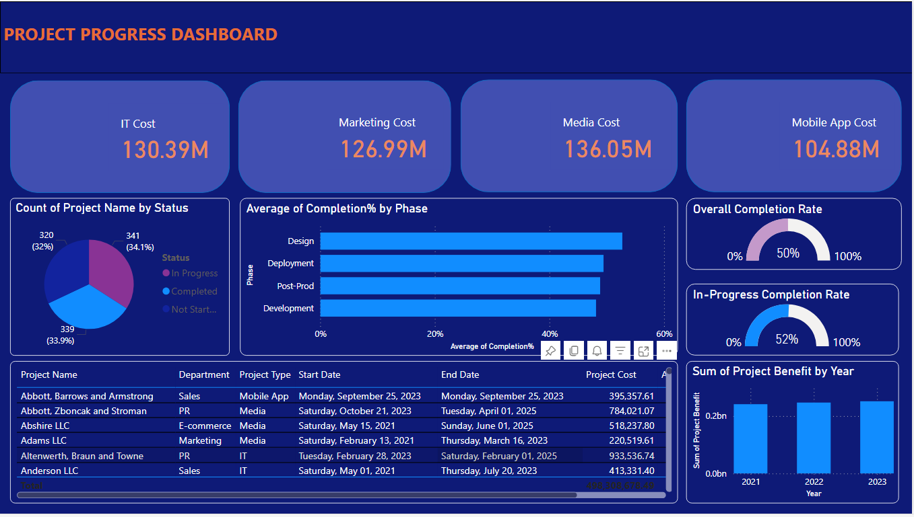

# Real-time Progressive Financial Analysis

Demo Published/Deplyed Dashboard Link -> https://app.powerbi.com/groups/me/reports/84e5afc6-ef40-464d-9f4b-8374e590fc0c/ReportSection?experience=power-bi

## Overview

This project provides a real-time financial analysis tool that tracks, visualizes, and predicts financial data. Built using a robust tech stack, the application offers users a comprehensive view of their financial status, helping them make informed decisions.

## Screesnshot

## Features

- **Real-time Data Tracking:** Automatically updates financial data in real-time.
- **Data Visualization:** Interactive charts and graphs for a clear representation of financial trends.
- **Predictive Analysis:** Utilizes machine learning algorithms to forecast future financial trends.
- **User-friendly Interface:** Easy-to-navigate UI built with modern web technologies.
- **Secure Data Management:** Ensures user data is securely stored and processed.

This project is licensed under the MIT License. See the [LICENSE](LICENSE) file for details.

## Contact

For any questions or suggestions, please contact:
- **Abhishek:** [abhishek992@gmail.com](mailto:abhishek992@gmail.com)

---
